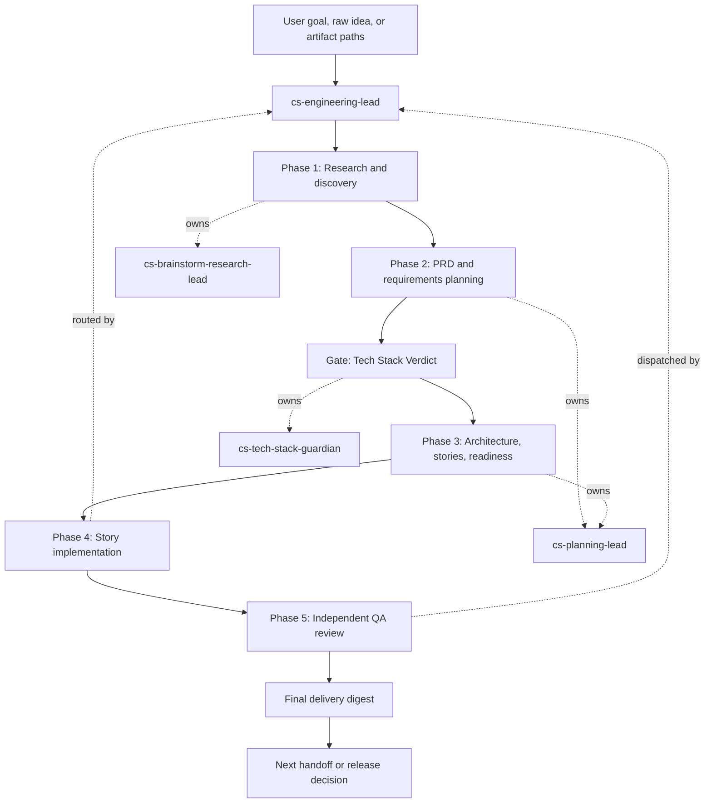
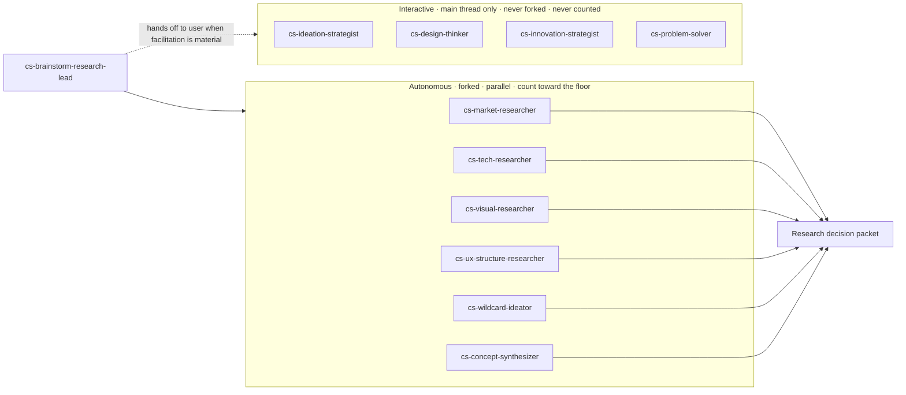
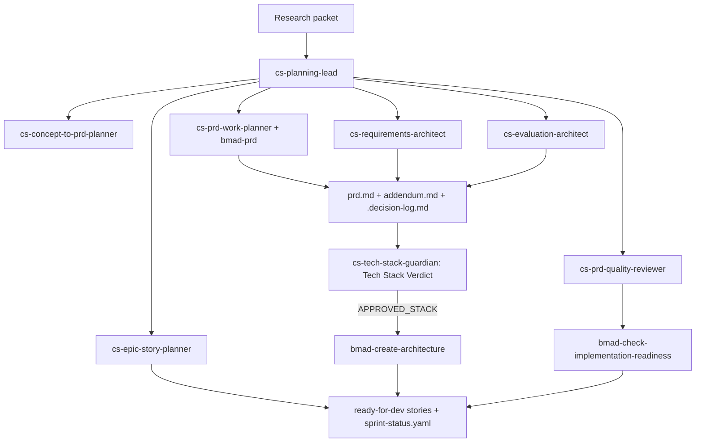
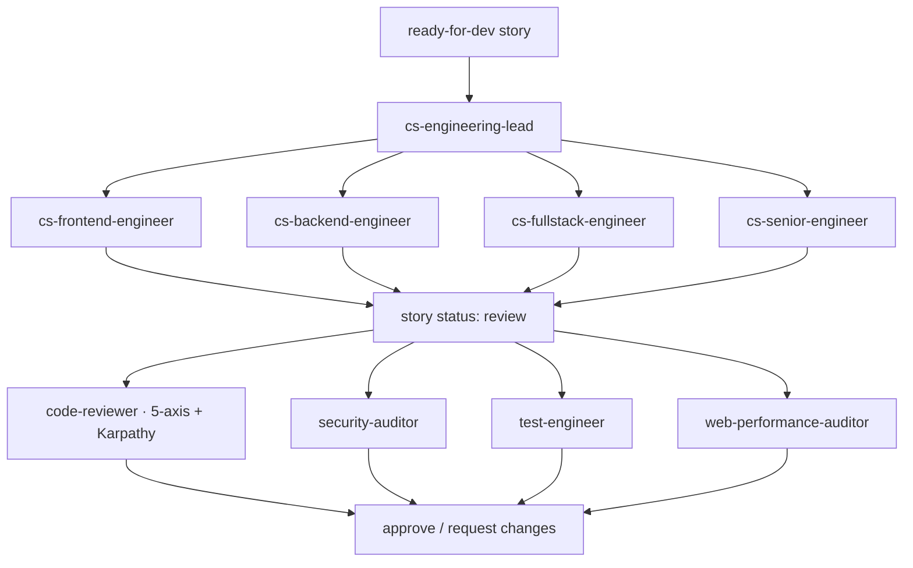
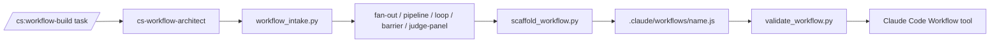

# BMAD-Method Agentic SDLC

<p align="center">
  <strong>Spec-driven, artifact-first software delivery for deep agents.</strong>
</p>

<p align="center">
  
  
  
  
</p>

BMAD-Method Agentic SDLC is a layered software development lifecycle for agentic delivery. It uses Claude Code agents, specialist personas, BMAD skills, commands, and optional deterministic workflows to take software work from idea discovery through PRD, architecture, evaluation, story implementation, QA review, and delivery.


This repository is not primarily a website or app. Generated apps, `app/`, and `sandbox/` are working surfaces and experiments. The core product is the **agentic SDLC system**.

## At A Glance

| Layer | Role | Examples |
| --- | --- | --- |
| Agent teams | Own lifecycle phases and specialist perspectives | `cs-engineering-lead`, `cs-planning-lead`, `code-reviewer` |
| Standards | One company tech stack and structure enforced before architecture | `cs-tech-stack-guardian`, `TECH-STANDARDS.md` |
| Skills | Execute repeatable methods and quality gates | `bmad-prd`, `bmad-dev-story`, `bmad-testarch-nfr` |
| Commands | Provide user-facing entry points | `/cs:workflow-build` |
| Artifacts | Carry context across phase boundaries | `prd.md`, `.decision-log.md`, `sprint-status.yaml` |
| Workflow automation | Makes repeatable multi-agent runs deterministic | `.claude/workflows/*.js` |

## Lifecycle



The **Tech Stack Verdict** between Phase 2 and Phase 3 is a hard gate. `cs-tech-stack-guardian` reads `TECH-STANDARDS.md` and must return `APPROVED` before any architecture decision locks in. A `DEVIATION-FLAGGED` or `EXCEPTION-REQUIRED` verdict blocks Phase 3 until resolved.

The lifecycle is intentionally gated. Agents do not just chat toward code; they create artifacts, hand them off, verify them, and keep implementation tied to specs and acceptance criteria.

## Delegation Model

This is the part to read if you want to judge whether the agent delegation "makes sense." The system is **delegation-first**: `cs-engineering-lead` is a coordinator, not a worker. It decomposes the goal, fans work out to the team that owns it, and only integrates results. Each team lead does the same to its own specialists.

### Who delegates to whom

```text
USER
 └─ cs-engineering-lead ............................... top coordinator (never implements)
     │
     ├─ Phase 1 ▸ cs-brainstorm-research-lead ......... research/discovery coordinator
     │     ├─ (autonomous · forked) cs-market-researcher
     │     ├─ (autonomous · forked) cs-tech-researcher
     │     ├─ (autonomous · forked) cs-visual-researcher        ← UI/brand work
     │     ├─ (autonomous · forked) cs-ux-structure-researcher  ← structure/journey/viz
     │     ├─ (autonomous · forked) cs-wildcard-ideator         ← when "crazy/weird" intent
     │     ├─ (autonomous · forked) cs-concept-synthesizer      ← converges evidence
     │     └─ (interactive · main thread only, never forked)
     │           cs-ideation-strategist · cs-design-thinker
     │           cs-innovation-strategist · cs-problem-solver
     │
     ├─ GATE  ▸ cs-tech-stack-guardian ................ Tech Stack Verdict (reads TECH-STANDARDS.md)
     │
     ├─ Phase 2+3 ▸ cs-planning-lead .................. PRD/architecture/stories coordinator
     │     ├─ cs-concept-to-prd-planner
     │     ├─ cs-requirements-architect
     │     ├─ cs-prd-work-planner          (authors the PRD)
     │     ├─ cs-evaluation-architect      (verification/quality-gate spine)
     │     ├─ cs-prd-quality-reviewer      (independent gate — author never self-approves)
     │     └─ cs-epic-story-planner        (epics, stories, sprint, readiness)
     │
     ├─ Phase 4 ▸ engineering implementers (siblings, parallel, disjoint files)
     │     ├─ cs-frontend-engineer
     │     ├─ cs-backend-engineer
     │     ├─ cs-fullstack-engineer        (cross-layer contract + integration)
     │     └─ cs-senior-engineer           (architecture/CI-CD/migration risk + review)
     │
     └─ Phase 5 ▸ QA roster (dispatched by the lead as siblings, not from inside engineering forks)
           ├─ code-reviewer              (5-axis + Karpathy simplicity/diff review)
           ├─ security-auditor           (OWASP + LLM Top 10; Critical/High block done)
           ├─ test-engineer              (coverage + Playwright browser-journey evidence)
           └─ web-performance-auditor    (Core Web Vitals; load/render/network)
```

### The three rules that make delegation legible

1. **Fan-out floor — `≥4 autonomous specialists per participating team`.** For non-trivial product delivery, each team that participates must actually invoke at least four autonomous specialists, not one or two. The point is breadth: a product seen through four lenses per team surfaces what a single owner misses. The floor is a minimum, not a cap. It relaxes below four only when a team's genuinely-applicable roster is smaller — and then the skipped agents must be named with reasons. It does **not** apply to trivial/small-direct changes or to incidents during stabilization.
2. **Writer ≠ sole reviewer.** The agent that writes a change can never be its only reviewer. Engineering forks self-review with `bmad-code-review`, then the lead dispatches the **independent** QA roster. On non-trivial stories all four QA agents run by default; each may drop only with a recorded, scope-based skip reason.
3. **Named project agents only.** Delegation uses only the personas under `.claude/agents/**`. Built-in/generalist agents (`general-purpose`, `claude`, unnamed fallbacks) are never substituted to hit the floor. If a named agent is unavailable, the lead records `PROJECT_AGENT_UNAVAILABLE: <agent>` and backfills with another named agent, runs an allowed current-context fallback, or returns the gap.

### Autonomous vs. interactive (a key constraint)

> **Facilitation is interactive; research is autonomous.**

- **Autonomous (`context: fork`)** agents run to completion with no user channel and are safe to spawn in parallel — the researchers, the wildcard ideator, the concept synthesizer, and all engineering/QA specialists.
- **Interactive (main-thread)** agents need the user's answers at each checkpoint — `cs-ideation-strategist`, `cs-design-thinker`, `cs-innovation-strategist`, `cs-problem-solver`. They are **never** forked (a fork would hang waiting for the user or fabricate answers) and never counted toward the fan-out floor.

Also note: a Claude Code fork cannot spawn another fork, so the lead dispatches engineering specialists as **siblings** rather than nesting them under `cs-fullstack-engineer`. The normal depth stays shallow: `main → engineering lead → team lead → specialist`.

The full routing logic — gate order, size classifier, and per-wave floors — lives in [`.claude/agents/engineering-team/cs-engineering-lead-decision-tree.md`](.claude/agents/engineering-team/cs-engineering-lead-decision-tree.md).

## Phase Map

| Phase | Coordinator | Specialists | Primary Skills | Output Artifacts |
| --- | --- | --- | --- | --- |
| 1. Research and discovery | `cs-brainstorm-research-lead` | **Autonomous (forked, count toward the floor):** `cs-market-researcher`, `cs-tech-researcher`, `cs-visual-researcher`, `cs-ux-structure-researcher`, `cs-wildcard-ideator`, `cs-concept-synthesizer`. **Interactive (main thread only, never forked or counted):** `cs-ideation-strategist`, `cs-design-thinker`, `cs-innovation-strategist`, `cs-problem-solver` — handed to the user only when their facilitation is material | `bmad-brainstorming`, `bmad-market-research`, `bmad-domain-research`, `bmad-technical-research`, `bmad-ux`, `bmad-prfaq`, `bmad-product-brief` | Locked problem and ICP, alternatives, evidence, wedge, risks, assumptions, validation test, visual manifest and UX benchmark when applicable |
| 2. PRD and requirements planning | `cs-planning-lead` | `cs-concept-to-prd-planner`, `cs-requirements-architect`, `cs-prd-work-planner`, `cs-evaluation-architect`, `cs-prd-quality-reviewer`, `cs-epic-story-planner` | `bmad-prd`, `bmad-ux`, `bmad-testarch-test-design`, `bmad-testarch-nfr`, `bmad-review-edge-case-hunter` | `prd.md`, `addendum.md`, `.decision-log.md`, FR/NFR/UJ IDs, UX benchmark traceability, evaluation spine, open questions |
| Gate. Tech stack validation (pre-Phase 3, mandatory) | `cs-engineering-lead` invokes `cs-tech-stack-guardian` | `cs-tech-stack-guardian` (architecture team) | Reads `TECH-STANDARDS.md` | Tech Stack Verdict (`APPROVED` / `DEVIATION-FLAGGED` / `EXCEPTION-REQUIRED`) and the `APPROVED_STACK` block carried into Phase 3 and every Phase 4 story brief |
| 3. Architecture, stories, readiness | `cs-planning-lead` | Planning specialists plus architecture and story workflows | `bmad-create-architecture`, `bmad-agent-architect`, `bmad-create-epics-and-stories`, `bmad-create-story`, `bmad-story-automator-review`, `bmad-check-implementation-readiness`, `bmad-sprint-planning`, `bmad-sprint-status` | Architecture artifacts, ADR/design decisions, epics, ready-for-dev stories, `sprint-status.yaml`, readiness verdict |
| 4. Story implementation | `cs-engineering-lead` | `cs-frontend-engineer`, `cs-backend-engineer`, `cs-fullstack-engineer`, `cs-senior-engineer` | `bmad-dev-story`, `bmad-code-review`, `bmad-quick-dev`, `bmad-testarch-atdd`, `bmad-testarch-trace`, `bmad-testarch-test-review`, `bmad-checkpoint-preview` | Changed files, tests/checks run, implementation notes, file list, story status moved to review |
| 5. Independent QA review | `cs-engineering-lead` | `code-reviewer`, `security-auditor`, `test-engineer`, `web-performance-auditor` | `code-review-and-quality`, `security-and-hardening`, `test-driven-development`, `browser-journey-audit`, `performance-optimization`, `browser-testing-with-devtools` | Findings by severity, runtime journey evidence, coverage gaps, security risks, performance risks, approve/request-changes verdict |

## Detailed Flow

<details>
<summary><strong>Phase 1: Research and discovery</strong></summary>



Expected output: locked problem, ICP, current alternatives, market and technical evidence, visual evidence when relevant, UX/UI structure benchmark when relevant, strategic wedge, key assumptions, contradictions, riskiest validation test, and artifact paths.

</details>

<details>
<summary><strong>Phase 2 and 3: Planning, architecture, and readiness</strong></summary>



The Tech Stack Verdict sits between Phase 2 and Phase 3: `cs-tech-stack-guardian` reads `TECH-STANDARDS.md`, classifies every proposed technology, and emits an `APPROVED_STACK` block. Architecture cannot begin while the verdict is `DEVIATION-FLAGGED` or `EXCEPTION-REQUIRED`. The `APPROVED_STACK` block is then passed verbatim into every Phase 4 story brief so no engineer re-litigates a covered technology choice.

Expected output: PRD workspace, requirements map, UX benchmark connector mapping when applicable, evaluation and verification spine, approved tech stack, architecture artifacts, epics, stories, sprint status, implementation-readiness verdict, blockers, and recommended engineering routing.

</details>

<details>
<summary><strong>Phase 4 and 5: Implementation and review</strong></summary>



Engineering implementers are dispatched as parallel siblings with non-overlapping file ownership and each self-reviews with `bmad-code-review` before moving its story to `review`. The QA roster is then dispatched **independently by the lead** (not from inside an engineering fork). The standalone `cs-karpathy-reviewer` has been retired — `code-reviewer` now carries the Karpathy simplicity, diff-noise, and goal-driven-execution review alongside its five-axis verdict.

Expected output: changed files, checks run, implementation notes, independent review findings, resolved or deferred risks, and the final delivery digest.

</details>

## Workflow Builder

Workflow automation is a supporting layer for repeatable SDLC tasks. It is not the project identity; it is how a recurring multi-agent process can become deterministic, resumable, and easier to run.



Key files live under `engineering/workflow-builder/`:

| Component | Purpose |
| --- | --- |
| `skills/workflow-builder/SKILL.md` | Workflow-builder operating rules. |
| `scripts/workflow_intake.py` | Recommends workflow topology from vague input. |
| `scripts/scaffold_workflow.py` | Generates starter workflow scripts. |
| `scripts/validate_workflow.py` | Validates deterministic workflow rules. |
| `commands/cs-workflow-build.md` | Slash command contract. |

## Repository Map

```text
.
|-- .claude/
|   |-- agents/                 Deep-agent personas used by Claude Code
|   |   |-- architecture-team/      cs-tech-stack-guardian (standards enforcer)
|   |   |-- brainstorm-research-team/  research/ideation leads + specialists
|   |   |-- planning-team/          PRD, requirements, evaluation, epics/stories
|   |   |-- engineering-team/       cs-engineering-lead + delegation decision tree
|   |   |-- engineering/            frontend/backend/fullstack/senior implementers
|   |   `-- qa-engineers/           code-reviewer, security, test, web-performance
|   |-- skills/                 BMAD, WDS, spec, development, test, and design skills
|   |-- scripts/                Helper scripts for visual capture and local automation
|   `-- settings.json           Claude Code workspace settings
|-- TECH-STANDARDS.md           Single company tech-stack/structure standard (guardian-owned)
|-- .claude-plugin/             Marketplace metadata for packaged skill/plugin distribution
|-- _bmad/                      BMAD configuration, modules, scripts, and workflow foundations
|-- _bmad-output/               Generated planning, implementation, and test artifacts
|-- engineering/
|   |-- workflow-builder/       Claude Code Workflow authoring skill, command, scripts, references
|   |-- skills/                 Advanced engineering skills, including spec-driven workflow
|   `-- */                      Additional focused skills, agents, and commands
|-- engineering-team/           Engineering-team skill packages and role guidance
|-- agents.md                   Root persona/orchestration rules
|-- CLAUDE.md                   Project invariants and agent behavior rules
|-- app/                        Generated/sample implementation surface, not the repo's purpose
|-- design-artifacts/           Design workflow scaffolding and outputs
|-- docs/                       Reserved project documentation area
`-- sandbox/                    Scratch/testing area for agent workflow experiments
```

## Main Agent Teams

| Team | Location | Purpose |
| --- | --- | --- |
| Brainstorm research | `.claude/agents/brainstorm-research-team/` | Idea validation, research, concept synthesis, visual evidence capture, and UX/UI structure benchmarking. Autonomous researchers fork; facilitation specialists stay interactive. |
| Architecture standards | `.claude/agents/architecture-team/` | `cs-tech-stack-guardian` — the single authority on the company tech stack and code structure; issues the mandatory pre-Phase 3 Tech Stack Verdict from `TECH-STANDARDS.md`. |
| Planning | `.claude/agents/planning-team/` | PRD creation, requirements architecture, evaluation spine, epics, stories, readiness. |
| Engineering lead | `.claude/agents/engineering-team/` | Delegation-first coordinator for delivery across research, planning, implementation, and review (`cs-engineering-lead`). Also hosts `cs-workspace-admin`. |
| Engineering implementers | `.claude/agents/engineering/` | Frontend, backend, fullstack, and senior engineer implementers (plus the standalone `cs-wiki-*` utility agents). |
| QA reviewers | `.claude/agents/qa-engineers/` | Independent review dispatched as siblings by the lead: `code-reviewer` (five-axis + Karpathy), `security-auditor`, `test-engineer`, `web-performance-auditor`. |

## Spec-Driven Method

The spec-first discipline appears in two places:

- `.claude/skills/spec-driven-development/` defines the lightweight gated flow: specify, plan, tasks, implement.
- `engineering/skills/spec-driven-workflow/` defines the stronger production workflow: requirements, complete spec, validation, test extraction, implementation, and self-review.

The expected contract is:

- No non-trivial implementation begins without a spec, PRD, or story artifact.
- Requirements are numbered and traceable.
- Acceptance criteria are testable.
- NFRs have measurable thresholds where possible.
- Implementation stays inside the approved scope.
- If an agent discovers missing requirements, the spec is updated before the code expands.

## Tech Standards

`TECH-STANDARDS.md` at the repository root is the single source of truth for what every project is built with — one company stack, enforced the same way each time. The current default stack is **TypeScript (strict) + native Web Components + Vite** on the frontend, **Fastify on Node.js 20 LTS with Zod** on the backend, **PostgreSQL via Supabase with raw SQL (no ORM)**, **Vitest + Playwright** for tests, **Biome** for lint/format, and **Vercel + Supabase + Upstash + GitHub Actions** for infra. It also fixes the feature-based folder structure, naming conventions, error-handling pattern (`AppError`), and a banned-technologies list.

- `cs-tech-stack-guardian` owns this file. It is the only agent that edits it, and only on explicit user confirmation.
- `cs-engineering-lead` must obtain a Tech Stack Verdict from the guardian **before Phase 3** for non-trivial work. The verdict's `APPROVED_STACK` block flows into every engineering story brief.
- Exceptions are project-scoped and logged in §12 of `TECH-STANDARDS.md`; changes are logged in §13. Trivial/small-direct changes skip the agent spawn but still follow the standard directly.

## Common Entry Points

Use these when running in a Claude Code environment with the agents and skills loaded.

```js
// Full product delivery from idea to implementation
Agent({
  subagent_type: "cs-engineering-lead",
  prompt: "Take this idea through research, planning, implementation, and review: <idea>"
})

// Planning only: PRD, requirements, evaluation, architecture, stories
Agent({
  subagent_type: "cs-planning-lead",
  prompt: "Create an implementation-ready planning package for: <concept or artifact paths>"
})

// Research only: validate a fuzzy idea before planning
Agent({
  subagent_type: "cs-brainstorm-research-lead",
  prompt: "Validate this app idea and produce a concept packet: <idea>"
})
```

For deterministic workflow authoring:

```text
/cs:workflow-build <repeatable multi-agent task>
```

## Quality Gates

Non-trivial delivery is expected to pass through these gates:

- Research packet accepted, with evidence and unresolved risks surfaced.
- UI-bearing work includes visual evidence and UX benchmark paths when applicable, or an explicit not-applicable/not-available reason.
- PRD or spec created and reviewed.
- Requirements and acceptance criteria are traceable.
- Evaluation spine exists before engineering starts.
- **Tech Stack Verdict is `APPROVED`** before Phase 3 architecture begins (non-trivial work); deviations and exceptions are resolved or logged in `TECH-STANDARDS.md`.
- Architecture and implementation-readiness checks are complete when architecture matters.
- Stories are `ready-for-dev` before implementation.
- The per-team **fan-out floor (≥4 autonomous specialists)** is met for non-trivial delivery, or under-floor teams carry explicit skip reasons.
- Engineering work is reviewed by a different agent than the one that wrote it.
- QA coverage includes code review, security, test strategy, Playwright-backed browser journey verification for user-facing web work, and web-performance review when applicable.
- **Source-control + deploy gate:** the project lands in its own GitHub repo (default private; public only when explicitly requested; no secrets in history) and, for deployable web apps, a live Vercel deployment with Supabase auth redirects pointed at production when Supabase auth is used.

## What To Ignore

- `sandbox/` is a scratch area for testing AI-agent workflows and should not define the project identity.
- `app/` is a generated or sample implementation surface. It may be useful as an output target, but it is not the core product.
- Large bundled skill directories under `engineering/` and `engineering-team/` are part of the agent capability library; read the specific skill or agent you are invoking rather than trying to load everything.

## Working On This Repo

- Update `agents.md` when changing persona composition rules.
- Update `.claude/agents/**` when changing agent behavior or handoff contracts. Keep the delegation map in this README and the [decision tree](.claude/agents/engineering-team/cs-engineering-lead-decision-tree.md) in sync with those changes.
- Update `TECH-STANDARDS.md` only through `cs-tech-stack-guardian` (with user confirmation); log the change in §13.
- Update `.claude/skills/**` or `engineering/**/skills/**` when changing reusable workflows.
- Update `engineering/workflow-builder/` when changing deterministic workflow automation.
- Preserve artifact paths and handoff receipts; downstream agents depend on them.
- Keep sandbox experiments isolated unless intentionally promoting them into the main workflow system.

## Status

This workspace currently contains the agent, skill, command, and BMAD infrastructure for a spec-driven Agentic SDLC. Generated artifacts and sample app work exist, but the primary project value is the lifecycle system that creates, validates, implements, and reviews software from structured specs.
