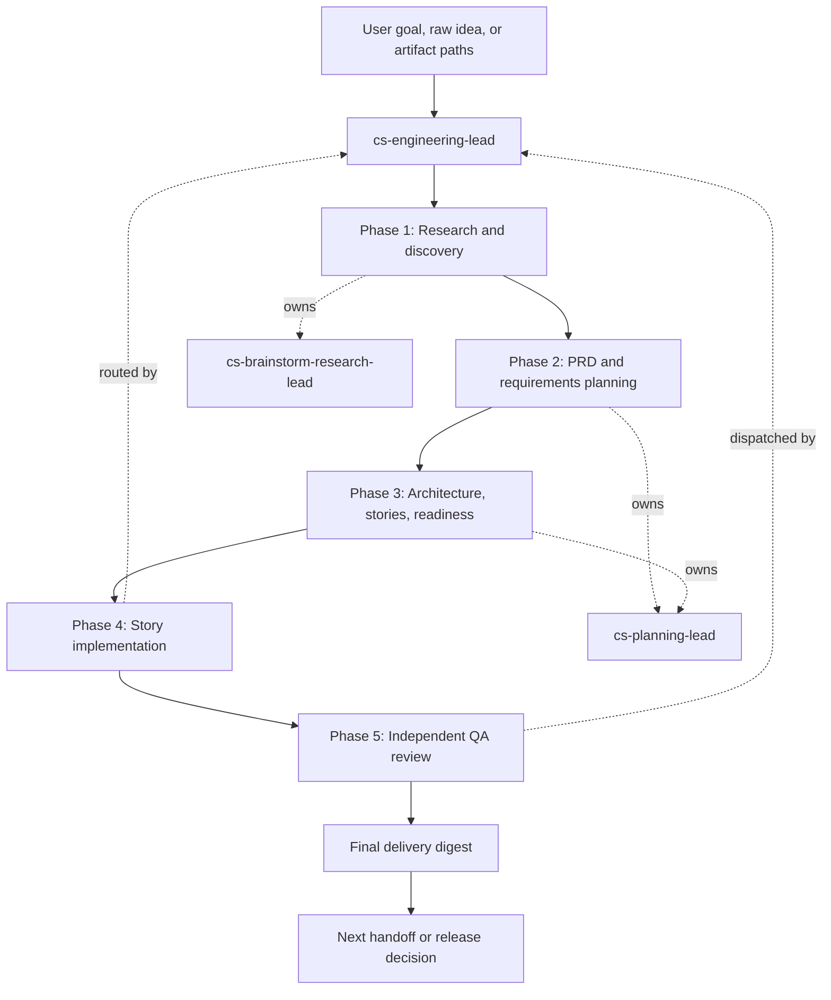
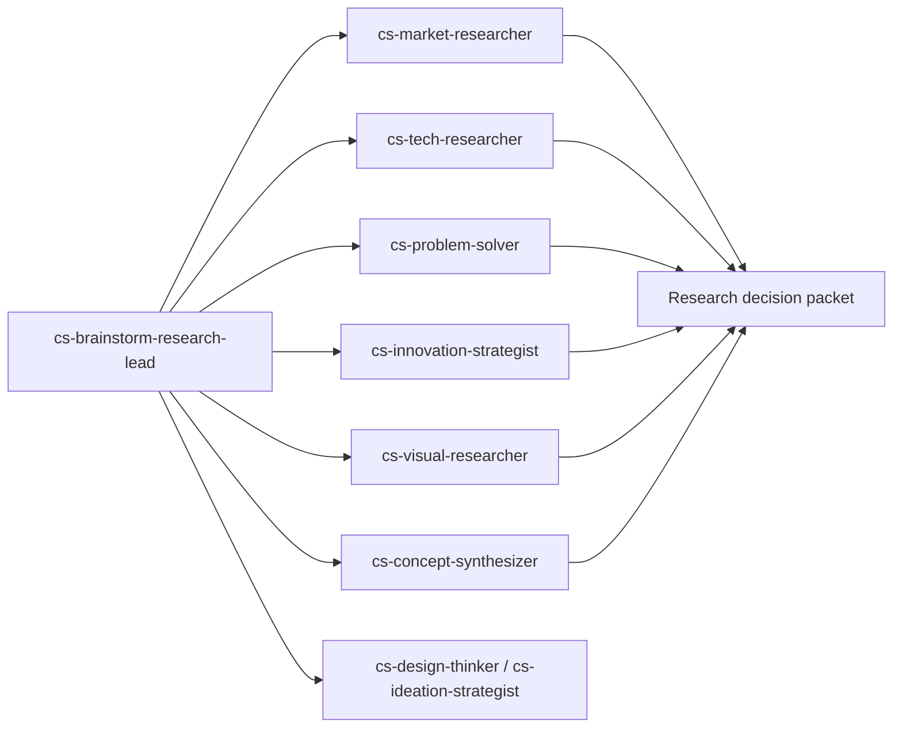
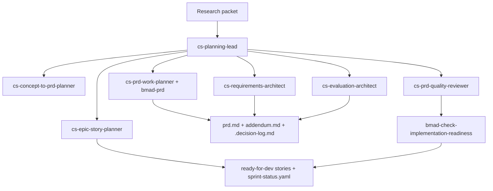
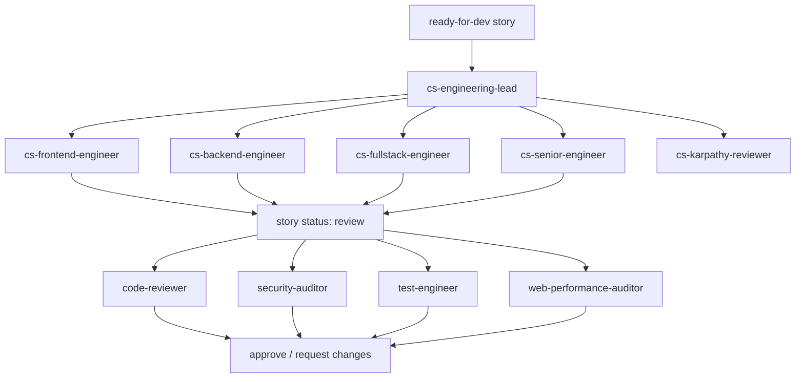
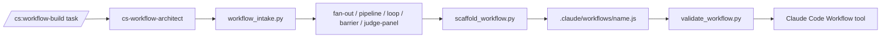

# BMAD-Method Agentic SDLC

<p align="center">
  <strong>Spec-driven, artifact-first software delivery for deep agents.</strong>
</p>

<p align="center">
  
  
  
  
</p>

BMAD-Method Agentic SDLC is a layered software development lifecycle for agentic delivery. It uses Claude Code agents, specialist personas, BMAD skills, commands, and optional deterministic workflows to take software work from idea discovery through PRD, architecture, evaluation, story implementation, QA review, and delivery.

This repository is not primarily a website or app. Generated apps, `app/`, and `sandbox/` are working surfaces and experiments. The core product is the **agentic SDLC system**.

## At A Glance

| Layer | Role | Examples |
| --- | --- | --- |
| Agent teams | Own lifecycle phases and specialist perspectives | `cs-engineering-lead`, `cs-planning-lead`, `code-reviewer` |
| Skills | Execute repeatable methods and quality gates | `bmad-prd`, `bmad-dev-story`, `bmad-testarch-nfr` |
| Commands | Provide user-facing entry points | `/cs:workflow-build` |
| Artifacts | Carry context across phase boundaries | `prd.md`, `.decision-log.md`, `sprint-status.yaml` |
| Workflow automation | Makes repeatable multi-agent runs deterministic | `.claude/workflows/*.js` |

## Lifecycle



The lifecycle is intentionally gated. Agents do not just chat toward code; they create artifacts, hand them off, verify them, and keep implementation tied to specs and acceptance criteria.

## Phase Map

| Phase | Coordinator | Specialists | Primary Skills | Output Artifacts |
| --- | --- | --- | --- | --- |
| 1. Research and discovery | `cs-brainstorm-research-lead` | `cs-market-researcher`, `cs-tech-researcher`, `cs-problem-solver`, `cs-innovation-strategist`, `cs-visual-researcher`, `cs-concept-synthesizer`, plus `cs-design-thinker` / `cs-ideation-strategist` when interactive facilitation is needed | `bmad-brainstorming`, `bmad-market-research`, `bmad-domain-research`, `bmad-technical-research`, `bmad-prfaq`, `bmad-product-brief` | Locked problem and ICP, alternatives, evidence, wedge, risks, assumptions, validation test, visual manifest when applicable |
| 2. PRD and requirements planning | `cs-planning-lead` | `cs-concept-to-prd-planner`, `cs-requirements-architect`, `cs-prd-work-planner`, `cs-evaluation-architect`, `cs-prd-quality-reviewer`, `cs-epic-story-planner` | `bmad-prd`, `bmad-ux`, `bmad-testarch-test-design`, `bmad-testarch-nfr`, `bmad-review-edge-case-hunter` | `prd.md`, `addendum.md`, `.decision-log.md`, FR/NFR/UJ IDs, evaluation spine, open questions |
| 3. Architecture, stories, readiness | `cs-planning-lead` | Planning specialists plus architecture and story workflows | `bmad-create-architecture`, `bmad-agent-architect`, `bmad-create-epics-and-stories`, `bmad-create-story`, `bmad-story-automator-review`, `bmad-check-implementation-readiness`, `bmad-sprint-planning`, `bmad-sprint-status` | Architecture artifacts, ADR/design decisions, epics, ready-for-dev stories, `sprint-status.yaml`, readiness verdict |
| 4. Story implementation | `cs-engineering-lead` | `cs-frontend-engineer`, `cs-backend-engineer`, `cs-fullstack-engineer`, `cs-senior-engineer`, `cs-karpathy-reviewer` | `bmad-dev-story`, `bmad-code-review`, `bmad-quick-dev`, `bmad-testarch-atdd`, `bmad-testarch-trace`, `bmad-testarch-test-review`, `bmad-checkpoint-preview` | Changed files, tests/checks run, implementation notes, file list, story status moved to review |
| 5. Independent QA review | `cs-engineering-lead` | `code-reviewer`, `security-auditor`, `test-engineer`, `web-performance-auditor` | `code-review-and-quality`, `security-and-hardening`, `test-driven-development`, `performance-optimization`, `browser-testing-with-devtools` | Findings by severity, coverage gaps, security risks, performance risks, approve/request-changes verdict |

## Detailed Flow

<details>
<summary><strong>Phase 1: Research and discovery</strong></summary>



Expected output: locked problem, ICP, current alternatives, market and technical evidence, visual evidence when relevant, strategic wedge, key assumptions, contradictions, riskiest validation test, and artifact paths.

</details>

<details>
<summary><strong>Phase 2 and 3: Planning, architecture, and readiness</strong></summary>



Expected output: PRD workspace, requirements map, evaluation and verification spine, architecture artifacts, epics, stories, sprint status, implementation-readiness verdict, blockers, and recommended engineering routing.

</details>

<details>
<summary><strong>Phase 4 and 5: Implementation and review</strong></summary>



Expected output: changed files, checks run, implementation notes, independent review findings, resolved or deferred risks, and the final delivery digest.

</details>

## Workflow Builder

Workflow automation is a supporting layer for repeatable SDLC tasks. It is not the project identity; it is how a recurring multi-agent process can become deterministic, resumable, and easier to run.



Key files live under `engineering/workflow-builder/`:

| Component | Purpose |
| --- | --- |
| `skills/workflow-builder/SKILL.md` | Workflow-builder operating rules. |
| `scripts/workflow_intake.py` | Recommends workflow topology from vague input. |
| `scripts/scaffold_workflow.py` | Generates starter workflow scripts. |
| `scripts/validate_workflow.py` | Validates deterministic workflow rules. |
| `commands/cs-workflow-build.md` | Slash command contract. |

## Repository Map

```text
.
|-- .claude/
|   |-- agents/                 Deep-agent personas used by Claude Code
|   |-- skills/                 BMAD, WDS, spec, development, test, and design skills
|   |-- scripts/                Helper scripts for visual capture and local automation
|   `-- settings.json           Claude Code workspace settings
|-- .claude-plugin/             Marketplace metadata for packaged skill/plugin distribution
|-- _bmad/                      BMAD configuration, modules, scripts, and workflow foundations
|-- _bmad-output/               Generated planning, implementation, and test artifacts
|-- engineering/
|   |-- workflow-builder/       Claude Code Workflow authoring skill, command, scripts, references
|   |-- skills/                 Advanced engineering skills, including spec-driven workflow
|   `-- */                      Additional focused skills, agents, and commands
|-- engineering-team/           Engineering-team skill packages and role guidance
|-- agents.md                   Root persona/orchestration rules
|-- CLAUDE.md                   Project invariants and agent behavior rules
|-- app/                        Generated/sample implementation surface, not the repo's purpose
|-- design-artifacts/           Design workflow scaffolding and outputs
|-- docs/                       Reserved project documentation area
`-- sandbox/                    Scratch/testing area for agent workflow experiments
```

## Main Agent Teams

| Team | Location | Purpose |
| --- | --- | --- |
| Brainstorm research | `.claude/agents/brainstorm-research-team/` | Idea validation, research, concept synthesis, visual evidence capture. |
| Planning | `.claude/agents/planning-team/` | PRD creation, requirements architecture, evaluation spine, epics, stories, readiness. |
| Engineering lead | `.claude/agents/engineering-team/` | Delegation-first coordinator for delivery across research, planning, implementation, and review. |
| Engineering implementers | `.claude/agents/engineering/` | Frontend, backend, fullstack, senior engineer, and simplicity review agents. |
| QA reviewers | `.claude/agents/qa-engineers/` | Code review, security audit, test review, and web performance review. |

## Spec-Driven Method

The spec-first discipline appears in two places:

- `.claude/skills/spec-driven-development/` defines the lightweight gated flow: specify, plan, tasks, implement.
- `engineering/skills/spec-driven-workflow/` defines the stronger production workflow: requirements, complete spec, validation, test extraction, implementation, and self-review.

The expected contract is:

- No non-trivial implementation begins without a spec, PRD, or story artifact.
- Requirements are numbered and traceable.
- Acceptance criteria are testable.
- NFRs have measurable thresholds where possible.
- Implementation stays inside the approved scope.
- If an agent discovers missing requirements, the spec is updated before the code expands.

## Common Entry Points

Use these when running in a Claude Code environment with the agents and skills loaded.

```js
// Full product delivery from idea to implementation
Agent({
  subagent_type: "cs-engineering-lead",
  prompt: "Take this idea through research, planning, implementation, and review: <idea>"
})

// Planning only: PRD, requirements, evaluation, architecture, stories
Agent({
  subagent_type: "cs-planning-lead",
  prompt: "Create an implementation-ready planning package for: <concept or artifact paths>"
})

// Research only: validate a fuzzy idea before planning
Agent({
  subagent_type: "cs-brainstorm-research-lead",
  prompt: "Validate this app idea and produce a concept packet: <idea>"
})
```

For deterministic workflow authoring:

```text
/cs:workflow-build <repeatable multi-agent task>
```

## Quality Gates

Non-trivial delivery is expected to pass through these gates:

- Research packet accepted, with evidence and unresolved risks surfaced.
- PRD or spec created and reviewed.
- Requirements and acceptance criteria are traceable.
- Evaluation spine exists before engineering starts.
- Architecture and implementation-readiness checks are complete when architecture matters.
- Stories are `ready-for-dev` before implementation.
- Engineering work is reviewed by a different agent than the one that wrote it.
- QA coverage includes code review, security, test strategy, and web-performance review when applicable.

## What To Ignore

- `sandbox/` is a scratch area for testing AI-agent workflows and should not define the project identity.
- `app/` is a generated or sample implementation surface. It may be useful as an output target, but it is not the core product.
- Large bundled skill directories under `engineering/` and `engineering-team/` are part of the agent capability library; read the specific skill or agent you are invoking rather than trying to load everything.

## Working On This Repo

- Update `agents.md` when changing persona composition rules.
- Update `.claude/agents/**` when changing agent behavior or handoff contracts.
- Update `.claude/skills/**` or `engineering/**/skills/**` when changing reusable workflows.
- Update `engineering/workflow-builder/` when changing deterministic workflow automation.
- Preserve artifact paths and handoff receipts; downstream agents depend on them.
- Keep sandbox experiments isolated unless intentionally promoting them into the main workflow system.

## Status

This workspace currently contains the agent, skill, command, and BMAD infrastructure for a spec-driven Agentic SDLC. Generated artifacts and sample app work exist, but the primary project value is the lifecycle system that creates, validates, implements, and reviews software from structured specs.
