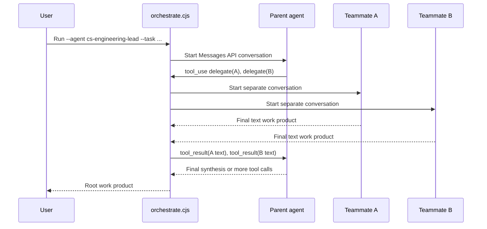
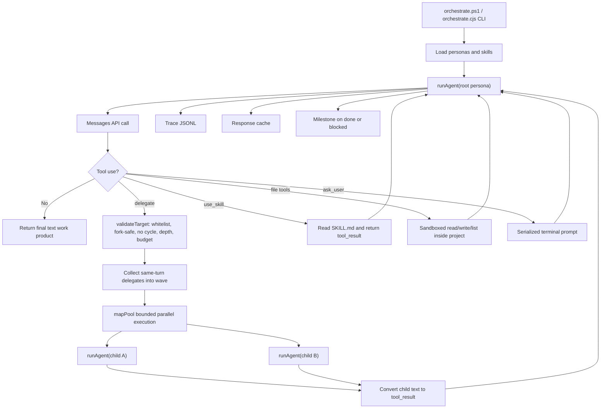

# orchestrate.cjs Architecture and Agent Teams Flow

This document explains how `.claude/scripts/orchestrate.cjs` works at an architecture level. It is written for presentation and handoff: what problem it solves, how work moves between agents, what "Agent Teams-style" means here, and what happens when a teammate finishes.

## Executive Summary

`orchestrate.cjs` is a custom delegation runner for this repository's project personas under `.claude/agents/**`.

It does not call Claude Code's native `Agent` tool directly. Instead, it loads the same persona Markdown files, exposes a controlled `delegate` tool to agents that are allowed to delegate, and recursively runs child agents through the Anthropic Messages API.

The model still decides whether to delegate and which named project agent to use. The script enforces the structure around that decision:

- only known project agents can be delegated to;
- interactive-only personas are refused as autonomous workers;
- recursion depth is capped;
- total delegation count is capped;
- cycles are refused;
- same-turn delegations can run in parallel;
- every delegation, result, file operation, skill load, and prompt is traced.

In short: the model plans, but the JavaScript runtime controls the delegation graph.

## Where It Fits

There are two related but different concepts:

| Concept | What it is | In this repo |
| --- | --- | --- |
| Claude Code native subagents | Claude Code's built-in `Agent` or `Task` style delegation. A subagent returns a report to the main agent. | The personas are compatible with this mode. |
| Claude Code native Agent Teams | Experimental CLI feature with teammates, `SendMessage`, mailbox-style communication, and a shared task list. | The personas are also designed to work as teammates when launched by Claude Code itself. |
| `orchestrate.cjs` | A separate Node.js runner that talks directly to `/v1/messages` and implements controlled delegation itself. | This is the script explained here. It adopts Agent Teams-style parallel execution but does not have native Agent Teams mailbox or shared task list tools. |

The important nuance: `orchestrate.cjs` uses an Agent Teams-like execution model, not the native Agent Teams runtime.

## Main Runtime Components

| Component | Responsibility |
| --- | --- |
| `parsePersona()` | Reads a persona Markdown file, parses frontmatter, extracts name/model/tools/body, and decides whether the persona is fork-safe. |
| `loadAgents()` | Recursively loads every persona under `.claude/agents/**` into a `Map` keyed by agent name. |
| `loadSkills()` | Finds `.claude/skills/<skill>/SKILL.md` files so agents can load skills through `use_skill`. |
| `resolveBackend()` and `callModel()` | Select and call the model backend: company proxy, Claude Code OAuth, or direct Anthropic API. |
| `buildTools()` | Builds the tool list available to the current agent node: `delegate`, `ask_user`, `use_skill`, `read_file`, `write_file`, and `list_files`, depending on persona capabilities and run options. |
| `runAgent()` | Core recursive loop. Runs one agent, handles tool calls, launches child agents, collects results, and returns final text. |
| `mapPool()` | Runs a wave of delegated teammates with bounded concurrency. This is the Agent Teams-style parallelism layer. |
| `makeTracer()` | Writes JSONL events to `<project>/.agent-state/orchestrate-<run-id>.jsonl`. |
| `makeCache()` | Stores completed model responses in `<project>/.agent-state/orchestrate-<run-id>.cache.jsonl` for deterministic resume. |
| `saveMilestone()` | Writes project milestone state through `milestone.cjs` when the run completes or halts. |

## Startup Flow

Typical entry point on this machine:

```powershell
powershell -NoProfile -ExecutionPolicy Bypass -File .claude/scripts/orchestrate.ps1 `
  --agent cs-engineering-lead `
  --task-file spec.md `
  --project sandbox/my-app `
  --run-id my-app-001 `
  --backend claude-code
```

Use `orchestrate.ps1` instead of raw `node` on the corporate network. The wrapper sets proxy variables, enables Node's environment proxy support, trusts the system CA, and forwards arguments to `orchestrate.cjs`.

At startup, `orchestrate.cjs`:

1. Loads all project personas from `.claude/agents/**`.
2. Loads repo skills from `.claude/skills/**/SKILL.md`.
3. Resolves the requested root agent from `--agent`.
4. Creates `.agent-state` inside the selected `--project`.
5. Saves the task snapshot as `.agent-state/orchestrate-<run-id>.task.txt`.
6. Creates a trace file and response cache for the run.
7. Calls `runAgent(rootAgent, task, depth = 0, ancestors = [], ctx)`.

## Agent Execution Loop

Each agent is run as an independent Messages API conversation.

At the start of `runAgent()`:

1. The script combines the persona body with orchestration instructions.
2. It creates a tool schema for that specific persona.
3. It sends the assigned task as the first user message.

Then the loop repeats until the agent returns normal text or reaches `--max-turns`:

1. Call the model.
2. Print the live transcript unless `--quiet` is set.
3. Log a `turn` event.
4. If the model returned final text, that text becomes the agent's work product.
5. If the model requested tools, execute the tools and send the tool results back.

The orchestration preamble tells agents that their final plain text is the work product returned to whoever delegated to them.

## Delegation Flow

Agents do not directly spawn other agents. They request the `delegate` tool.

Only personas whose frontmatter includes `Agent` receive this tool. Other personas are leaf workers unless they have other tools such as `Read`, `Write`, or `Skill`.

When an agent calls:

```json
{
  "agent": "cs-frontend-engineer",
  "task": "Implement the login page from this story..."
}
```

the script performs validation before anything is launched:

1. Is the target a known project persona?
2. Is it fork-safe, meaning not interactive-only?
3. Would this create a cycle by delegating to an ancestor?
4. Would this exceed `--max-depth`?
5. Would this exceed `--max-delegations`?

If validation fails, the parent agent receives an error-like tool result and must adapt. If depth or budget caused the refusal, the overall run is marked incomplete and resumable.

If validation passes, the child is scheduled for execution.

## Agent Teams-Style Parallelism

The script treats multiple `delegate` calls from the same model turn as one teammate wave.

Example:

```text
Root agent turn:
  delegate -> cs-market-researcher
  delegate -> cs-tech-researcher
  delegate -> cs-ux-structure-researcher
```

Those three child agents are collected into a wave and run through `mapPool()` with at most `--max-parallel` workers. The default is `4`.

This is why the docs call it "Agent Teams-style":

- the lead can fan out independent work in one turn;
- teammates run concurrently;
- the transcript shows team launch and return status;
- the parent later synthesizes all teammate work.

But unlike native Agent Teams:

- there is no direct `SendMessage` between teammates;
- there is no native shared task list API;
- teammates cannot inspect each other's in-memory conversation;
- the parent agent is the synchronization point.

## What Happens When a Teammate Finishes

When a delegated child finishes, it returns final plain text from its own `runAgent()` call.

The orchestrator then:

1. Logs a `result` event with `{ from: child, to: parent }`.
2. Converts the child's text into a Messages API `tool_result`.
3. Places that `tool_result` in the parent conversation at the same index as the original `delegate` tool call.
4. Sends all tool results back to the parent agent in one user message.

Important detail: results are returned to the parent in original `tool_use` order, even if teammates finished in a different order.

The parent then sees something equivalent to:

```text
Tool result for delegate call 1:
  cs-market-researcher's report

Tool result for delegate call 2:
  cs-tech-researcher's report

Tool result for delegate call 3:
  cs-ux-structure-researcher's report
```

The parent decides what to do next:

- synthesize the results into a final answer;
- delegate another wave;
- call `use_skill`;
- ask the user;
- write/read files if allowed;
- stop with a final work product.

## Viewing The Agent Conversation Logs

Future runs save capped conversation snippets into the trace JSONL. To render those logs into a readable Markdown report:

```powershell
node .claude/scripts/orchestrate-log-viewer.cjs `
  --project sandbox/my-app `
  --run-id my-app-001 `
  --out sandbox/my-app/.agent-state/orchestrate-my-app-001.report.md
```

You can also point directly at a trace file:

```powershell
node .claude/scripts/orchestrate-log-viewer.cjs `
  --file sandbox/my-app/.agent-state/orchestrate-my-app-001.jsonl
```

The report shows:

- delegation edges, such as `cs-engineering-lead -> cs-frontend-engineer`;
- teammate waves, meaning same-turn delegates that ran in bounded parallelism;
- each agent turn's saved text snippet and tool calls;
- returned `result` payloads from child agents to their parent;
- user prompts, file operations, refusals, and errors.

The trace text is capped by `--trace-text-chars` or `ORCH_TRACE_TEXT_CHARS` to prevent logs from ballooning. The default cap is `2000` characters per saved text field.

## What `result` Means

In this runner, `result` has a specific technical meaning:

```text
child agent final text
  -> orchestrate.cjs
  -> parent receives it as tool_result.content
```

It is not direct teammate-to-teammate communication.

For example, if `cs-engineering-lead` delegates to `cs-frontend-engineer`, the frontend agent eventually returns plain text such as:

```text
Implemented the login screen, wrote src/features/auth/LoginForm.ts, and left npm test as the next command.
```

`orchestrate.cjs` wraps that exact child work product as:

```json
{
  "type": "tool_result",
  "tool_use_id": "toolu_...",
  "content": "Implemented the login screen..."
}
```

Then the parent agent sees that tool result and decides whether to synthesize, delegate follow-up work, or finish. If another teammate needs that information, the parent must pass it in a later delegated task.

## Communication Model

Communication is parent-mediated.



There is no teammate-to-teammate message path in `orchestrate.cjs`.

If one teammate needs information from another, the parent must coordinate it in a later turn: receive result A, receive result B, then delegate a follow-up task with the needed context.

## Shared Task List and State

Native Claude Code Agent Teams can have team-coordination tools such as `SendMessage` and shared task-list surfaces. `orchestrate.cjs` does not expose those tools because it is not running inside the native Agent Teams harness.

Instead, this script has these durable state surfaces:

| State surface | Path | Purpose |
| --- | --- | --- |
| Task snapshot | `<project>/.agent-state/orchestrate-<run-id>.task.txt` | Saves the original task so resume commands do not need the full task text again. |
| Trace log | `<project>/.agent-state/orchestrate-<run-id>.jsonl` | Append-only audit log of turns, delegations, results, refusals, skill loads, file effects, and user prompts. |
| Response cache | `<project>/.agent-state/orchestrate-<run-id>.cache.jsonl` | Stores completed model responses so a resumed run can replay finished work without spending again. |
| Milestone | `MILESTONE.md` plus `.agent-state/milestone.json` | Human-readable and machine-readable run status, written through `milestone.cjs`. |
| Project files | Anything inside `--project`, except `.agent-state` writes are refused | Shared filesystem output for agents with `write_file`, `read_file`, or `list_files`. |

The closest equivalent to a shared task list in this runner is the trace plus milestone:

- the trace records what happened;
- the milestone records what is complete and how to resume;
- the parent agent owns live task synthesis during the run.

It is not a collaborative task board that agents update directly.

## File Effects

Agents whose persona frontmatter includes `Write` can receive `write_file`.
Agents whose frontmatter includes `Read` can receive `read_file` and `list_files`.

All file paths are resolved inside `--project`. The script refuses:

- paths that escape the project directory;
- writes into `.agent-state`;
- shell access of any kind.

This means implementation agents can create real project files, but they cannot run installs, builds, tests, or arbitrary shell commands through this orchestrator. They should list commands for the human or main Claude Code session to run afterward.

Because file tool calls are part of cached model responses, replaying a cached run can rebuild the same files deterministically.

## Skills

If a persona's frontmatter includes `Skill`, `buildTools()` exposes `use_skill`.

The agent can call:

```json
{
  "skill": "some-skill-name"
}
```

The script returns that skill's `SKILL.md` body as a tool result, capped by `--skill-max-chars`.

Skill loads are visible in two places:

- live transcript;
- trace event: `skill`.

## User Input

If the run is interactive, agents can receive `ask_user`.

This is for decisions that genuinely require the human, such as choosing from a concept board. The script serializes prompts with a mutex so parallel teammates cannot compete for terminal input.

Behavior:

- total questions are capped by `--max-asks`;
- each prompt has a countdown controlled by `--ask-timeout`;
- if the user does not answer, the run proceeds with a no-response message;
- real answers are cached so resume does not ask again.

In headless mode (`--no-interactive` or non-TTY input), agents are told to make reasonable assumptions instead.

## Resume and Failure Handling

Every model response is cached by request hash. Because the delegation loop is deterministic given the same model responses, the same `--run-id` can replay completed work and continue from the first unfinished call.

This matters for rate limits and large graphs.

On retryable HTTP errors such as `429`, `500`, `502`, `503`, or `529`:

1. `callModel()` retries with backoff up to `--max-retries`.
2. If still failing, the error propagates.
3. Finished siblings in a parallel wave remain cached.
4. The run saves a blocked milestone with a resume command.
5. Re-running with the same `--run-id` replays cached work and continues at the failed point.

For ordinary teammate failures inside a wave, the parent gets a failure text result for that one child, while siblings continue. For rate limits, the wave settles first, then the rate-limit error is propagated so the parent does not synthesize from a fake failed work product.

## Trace Events to Know

The trace file is JSONL. Useful event types:

| Event | Meaning |
| --- | --- |
| `turn` | An agent completed one model turn. |
| `delegate` | Parent requested and passed validation for a child agent. |
| `team_wave` | A same-turn group of delegates launched as a bounded parallel wave. |
| `result` | Child returned a work product to parent. |
| `refused` | Delegation or prompt refused by guardrails or budget. |
| `error` | Child execution failed. |
| `skill` | Agent loaded a skill. |
| `write`, `read`, `list` | Sandboxed file operation happened. |
| `fs_refused` | File operation was rejected by sandbox rules. |
| `ask_user`, `ask_user_answer` | Human prompt and answer were recorded. |

The final console output also prints a delegation tree and per-agent counts.

## Architecture Diagram



## Talking Points for a Boss

1. The system uses repository-defined specialist personas, not generic agents.
2. The model can propose delegation, but JavaScript enforces who can be called and how deep the graph can go.
3. "Agent Teams-style" means parallel fan-out of independent same-turn tasks, not native Agent Teams shared mailbox behavior.
4. Completed teammate work returns as structured tool results to the parent agent, which synthesizes the next step.
5. The durable record is the trace/cache/milestone set under `.agent-state`, not a live shared task board.
6. The design favors auditability and resumability: every hop is logged, and interrupted runs can resume with the same `--run-id`.
7. File effects are sandboxed to the project directory, and there is no shell execution inside child agents.

## Limitations and Risks

- Teammates do not message each other directly in this runner.
- There is no native Agent Teams shared task list inside `orchestrate.cjs`.
- Parallel workers share the project filesystem, so parent agents should assign non-overlapping file responsibilities.
- The runner does not execute builds, tests, installs, or shell commands.
- Cache resume is tied to the exact request body. Changes to system prompts, tool schemas, or orchestration code can invalidate old cache hits.
- The parent agent is responsible for synthesis quality. The script guarantees graph shape and traceability, not correctness of reasoning.

## One-Sentence Explanation

`orchestrate.cjs` is a controlled multi-agent runner: it lets repo personas delegate to other named personas, executes same-turn delegations in parallel like an Agent Team, returns each teammate's final text to the parent as a tool result, and records the whole run in trace/cache/milestone files so the work is auditable and resumable.
