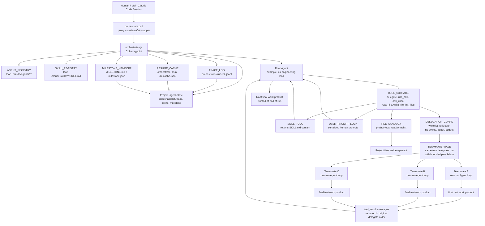
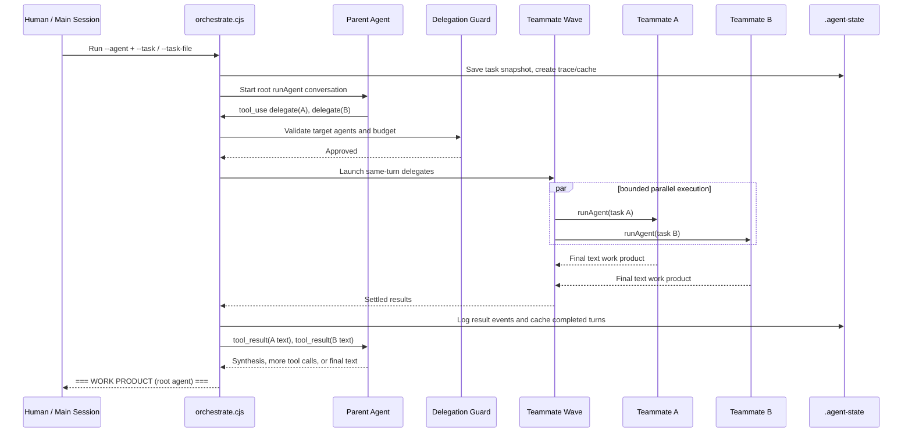
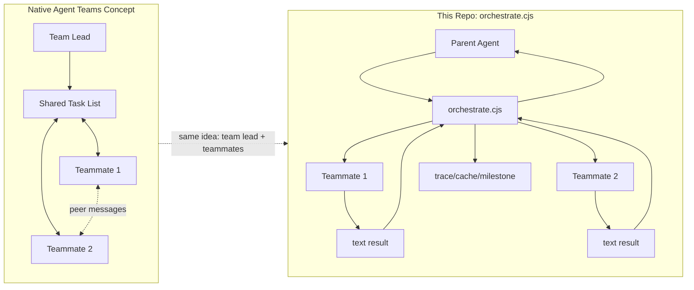

# Orchestrator Architecture Graph

This graph shows how this repo's orchestration architecture connects. It is close to the Agent Teams idea in that the lead can fan out work to teammates in parallel, but this implementation keeps communication parent-mediated through `orchestrate.cjs`.

## High-Level Connection Graph



## Delegation Lifecycle



## Communication Model



## Presenter Summary

- The root agent acts like the team lead.
- The lead asks for delegation through `delegate`; the code validates it before launching anything.
- Multiple delegates in the same turn become a parallel teammate wave.
- Teammates do not talk directly to each other in this runner.
- Each teammate returns a final text work product to the orchestrator.
- The orchestrator sends those results back to the parent as `tool_result` messages.
- Durable state lives in `.agent-state`: trace, cache, task snapshot, and milestone.
- Project file writes are sandboxed inside `--project`.

## How To Verify The Graph From Logs

After an orchestrated run, render the trace into Markdown:

```powershell
node .claude/scripts/orchestrate-log-viewer.cjs `
  --project sandbox/my-app `
  --run-id my-app-001 `
  --out sandbox/my-app/.agent-state/orchestrate-my-app-001.report.md
```

Use the report to verify:

- `Delegation Edges` proves which parent delegated to which teammate.
- `Team Waves` proves which teammates were launched together.
- `Returned Results` shows the child final work product sent back to the parent.
- `Chronological Agent Turns` shows each saved agent text snippet and tool call.

The important interpretation rule is that `result` is not peer-to-peer chat. It is the child agent's final text work product returned to `orchestrate.cjs`, then injected back into the parent conversation as `tool_result.content`.
